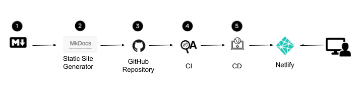

# Tutorial

In this tutorial we describe an implementation of Docs as Code. First, we define what Docs as Code is and describe the process that we follow to develop documentation. Then, we list the tools that we use and we go through the process of configuring each one of them for this implementation.

## What is Docs as Code?

Docs as Code is treating documentation as a software product. We use the same tools that are used in software development—IDE, Git, and CI/CD—to write and publish a project's documentation. Also, we use the same tools that software developers use. As a result, we deliver the documentation in the same way we deliver software.

## Tools

There are several tools that we can use to implement docs as code. For this implementation, we use the following tools:

* **Markdown:** Create our documents as plain text files and use a Markup language.
* **VS Code:** Use an IDE to edit our documents. 
* **Mkdocs:** Use a static site generator. 
* **GitHub:** Use Git for file management and collaboration.
* **HTMLProofer and Vale:** Test our documentation. We check for missing links and use a prose linter.
* **GitHub Actions:** Build and publish the documentation site continuously.

We automatically deploy our documentation site after every commit we make.

## How is the Process of Docs as Code?

To deliver documentation as code, we follow a similar process as software development. The following image shows the workflow of the implementation of Docs as Code:

**Create the documents in Markdown**. We create our documentation using a Markup language.

**Create a static site with the Markdown files**. We use Mkdocs to create our documentation site.

**Push the Markdown files to GitHub**. We use GitHub to control the versions of our documentation site.

**Test the documents**. We create a continuous integration workflow to build and test the HTML files of our documentation site.

**Deploy the static site**. We create a continuous deployment workflow to deploy our documentation site to Netlify. 

## How we Implement Docs as Code

We need to set up and configure the tools mentioned in section Tools so that we can start creating documentation. In this tutorial we go throught the following steps to create our implementation:

* [**Step 1:** Create the Static Site.](step1.md)
* [**Step 2:** Create a GitHub repository.](step2.md)
* [**Step 3:** Add the Vale YAML Extension files.](step3.md)
* [**Step 4:** Create the continuous integration workflow.](step4.md)
* [**Step 5:** Create the continuous deployment workflow.](step5.md)